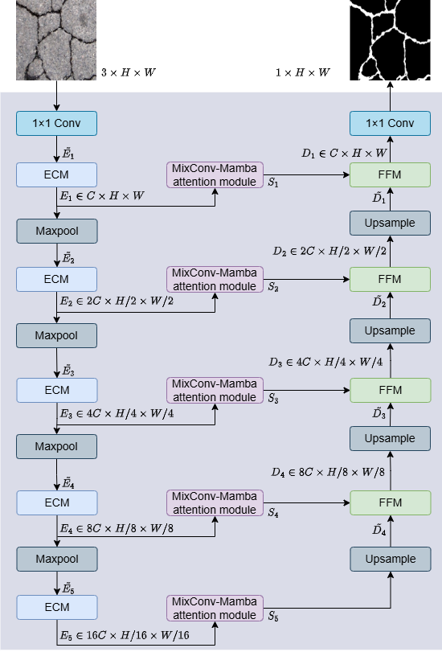

# Crack segmentation network via difference convolution-based encoder and hybrid CNN-Mamba multi-scale attention



You can complete the training on the Deepcrack dataset by following the steps below. The author does not frequently check GitHub. If there are any issues, please send an email to the second author.
1. install torch
    ```shell
    conda install pytorch==2.2.1 torchvision==0.17.1 torchaudio==2.2.1 pytorch-cuda=12.1 -c pytorch -c nvidia
    ```
2. install dependent libraries
    ```shell
    pip install -r requirements.txt
    ```
3. install Mamba
    ```shell
    cd net/selective_scan && pip install . && cd ../..
    ```
4. train
    ```shell
    python train.py
    ```
If you have used our code, please cite our paper.
```bibtex
@article{ZHANG2025111723,
title = {Crack segmentation network via difference convolution-based encoder and hybrid CNN-Mamba multi-scale attention},
journal = {Pattern Recognition},
volume = {167},
pages = {111723},
year = {2025},
issn = {0031-3203},
doi = {https://doi.org/10.1016/j.patcog.2025.111723},
url = {https://www.sciencedirect.com/science/article/pii/S0031320325003838},
author = {Jianming Zhang and Shigen Zhang and Dianwen Li and Jianxin Wang and Jin Wang},
}
 ```
